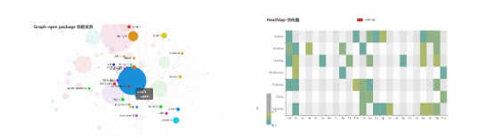
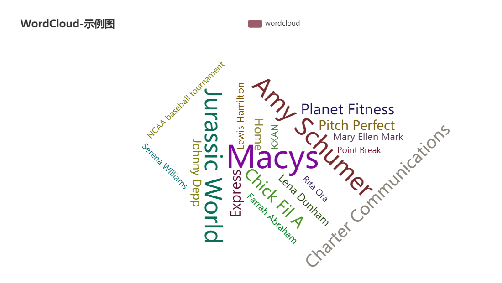

## 트랜드 분석


## 개발환경 설정


### 1. go lang 설치 

* go 언어

>GO 프로그래밍 언어는 2007년 구글에서 개발을 시작하여 2012년 GO 버젼 1.0을 완성하였다. GO는 이후 계속 향상된 버젼을 내 놓았으며 2022년 초에는 버젼 1.18 에 이르렀다.

> GO 공식 사이트: https://go.dev/ (혹은 https://golang.org)

>흔히 golang 이라고도 불리우는 Go 프로그래밍 언어는 구글의 V8 Javascript 엔진 개발에 참여했던 Robert Griesemer, Bell Labs에서 유닉스 개발에 참여했던 Rob Pike, 그리고 역시 Bell Labs에서 유닉스 개발했으며 C 언어의 전신인 B 언어를 개발했던 Ken Thompson이 함께 개발하였다.

>Go는 전통적인 컴파일, 링크 모델을 따르는 범용 프로그래밍 언어이다. Go는 일차적으로 시스템 프로그래밍을 위해 개발되었으며, C++, Java, Python의 장점들을 뽑아 만들어졌다. C++와 같이 Go는 컴파일러를 통해 컴파일되며, 정적 타입 (Statically Typed)의 언어이다. 또한 Java와 같이 Go는 Garbage Collection 기능을 제공한다. Go는 단순하고 간결한 프로그래밍 언어를 지향하였는데, Java의 절반에 해당하는 25개의 키워드만으로 프로그래밍이 가능하게 하였다. 마지막으로 Go의 큰 특징으로 Go는 Communicating Sequential Processes (CSP) 스타일의 Concurrent 프로그래밍을 지원한다.


#### go 다운로드
[](https://go.dev/dl/go1.18.3.windows-amd64.msi)
##### go 설치 위치
````
c:\Go
````

##### 환경 설정 

* 환경 변수 설정 

```sh
D:\Code\lk>set
GOPATH=C:\Gocode
GOROOT=C:\Go
```
Path 설정에  `C:\Gocode\bin;C:\Go\bin` 추가 


### 2. vscode 설치 

* vs code 다운로드

[https://code.visualstudio.com/download](https://code.visualstudio.com/download)


#### vs code에서 go tool 설치

vs code에서 ctl-shift-p 누른 상태에서  `Go:Install Update 선택`

```
Tools environment: GOPATH=C:\Gocode
Installing 7 tools at C:\Gocode\bin in module mode.
  gotests
  gomodifytags
  impl
  goplay
  dlv
  staticcheck
  gopls
```


#### go package 설치 

```sh
C:\Gocode\src\gtrend>go mod init 
C:\Gocode\src\gtrend>go get 
go: downloading github.com/go-echarts/go-echarts/v2 v2.2.4
go: downloading github.com/go-echarts/go-echarts v1.0.0
go get: added github.com/go-echarts/go-echarts/v2 v2.2.4
C:\Gocode\src\gtrend>go mod init
go: C:\Gocode\src\gtrend\go.mod already exists
C:\Gocode\src\gtrend>go mod vendor
```


### 3. git  설정

* 다운로드 및 설치 

https://git-scm.com/book/ko/v2

#### git 설정

* git clone
```sh
C:\Gocode\src\gtrend>git clone https://github.com/jhyunleehi/gtrend.git 
Cloning into 'gtrend'...
remote: Enumerating objects: 72, done.
remote: Counting objects: 100% (72/72), done.
remote: Compressing objects: 100% (44/44), done.
remote: Total 72 (delta 20), reused 61 (delta 20), pack-reused 0
Unpacking objects: 100% (72/72), done.
```


* git 초기화 설정이 필요할 경우 
```sh
C:\Gocode\src\gtrend>git add .
C:\Gocode\src\gtrend>git commit -m "first commit"
C:\Gocode\src\gtrend>git push  -u --force origin master
C:\Gocode\src\gtrend>git log
C:\Gocode\src\gtrend>git  remote  add  origin https://github.com/jhyunleehi/gtrend.git 
C:\Gocode\src\gtrend>git remote -v
origin  https://github.com/jhyunleehi/gtrend.git (fetch)
origin  https://github.com/jhyunleehi/gtrend.git (push)
```

* git checkout branch, push
```sh
C:\Gocode\src\gtrend>git checkout -b develop
C:\Gocode\src\gtrend>git push --set-upstream origin develop
Total 0 (delta 0), reused 0 (delta 0)
remote: 
remote: Create a pull request for 'develop' on GitHub by visiting:
remote:      https://github.com/jhyunleehi/gtrend/pull/new/develop
remote:
To https://github.com/jhyunleehi/gtrend.git
 * [new branch]      develop -> develop
Branch 'develop' set up to track remote branch 'develop' from 'origin'.
```


### 4. Post man 설치 

https://www.postman.com/


## 단계별 프로그램 개발 


### step 1. 키자드 검색어 추출

#### 리얼타임 검색어
https://keyzard.org/realtimekeyword

여기서 동적 페이지 분석 해서 키워드  추출

https://signal.bz/ 
여기는 추출이 잘 안된다. 이유는 나중에 살펴봐야 할듯

```sh
$ go mod vendor
```

실행 로그 write 한다. 


### step 2. 연관 검색어 추출

1. json 프로토콜 이용한 데이터 추출
2. 함수 예외 처리 방법
3. 배열 처리 방법
4. Map 객체 사용하는 방법
5. time date 연산

####  연관 검색어 추출 
* 쇼셜 빅데이터 
https://m.some.co.kr/sometrend/analysis/composite/v2/association-transition


#### 연관 검색어 추출
https://keyzard.org/keyzard

여기서 동적 페이지 분석 해서 키워드  추출


키워드 마법사에서  
https://keyzard.org/keyzard


요청 URL: https://keyzard.org/query/searchs
요청 메서드: POST
상태 코드: 200 
원격 주소: 172.67.170.210:443

{relKeyword: "검건모", request_qr: "10"}
relKeyword: "검건모"
request_qr: "10"


응답데이터는 JSON 
```json
{"auto_google":[{"relKeyword":"대한민국파라과이","monthlyPcQcCnt":9880,"monthlyMobileQcCnt":43900,"qcCnt":0,"total":15939,"updateDate":"2022-06-09 13:37:33","errorCode":0,"keywordLevel":1,"garbageKeyword":0,"monthlyAvePcClkCnt":"0","monthlyAveMobileClkCnt":"0","monthlyAvePcCtr":"0","monthlyAveMobileCtr":"0","plAvgDepth":"0","compIdx":"낮음","webTotal":null,"productTotal":null,"keyword":null,"ip":null,"uuid":null,"type":null,"upDt":null,"update_date":"2022-06-09 13:37:33"},{"relKeyword":"대한민국축구","monthlyPcQcCnt":9010,"monthlyMobileQcCnt":53200,"qcCnt":0,"total":349975,"updateDate":"2022-06-03 19:22:33","errorCode":0,"keywordLevel":1,"garbageKeyword":0,"monthlyAvePcClkCnt":"0","monthlyAveMobileClkCnt":"0.3","monthlyAvePcCtr":"0","monthlyAveMobileCtr":"0.01","plAvgDepth":"3","compIdx":"높음","webTotal":null,"productTotal":null,"keyword":null,"ip":null,"uuid":null,"type":null,"upDt":null,"update_date":"2022-06-03 19:22:33"}, ...
````

#### naver 개발센터 등록

네이버 오픈API를 사용하려면 먼저 네이버 개발자 센터에서 애플리케이션을 등록하고 클라이언트 아이디와 클라이언트 시크릿을 발급받아야 합니다.

클라이언트 아이디와 클라이언트 시크릿은 인증된 사용자인지를 확인하는 수단이며, 애플리케이션이 등록되면 발급됩니다. 클라이언트 아이디와 클라이언트 시크릿을 네이버 오픈API를 호출할 때 HTTP 헤더에 포함해서 전송해야 API를 호출할 수 있습니다. API 사용량은 클라이언트 아이디별로 합산됩니다.

1. https://developers.naver.com

* 개발자 페이지 접속 

2.  계정 정보 등록

3. ClientID 발급
```
ADL5C7Yjg4C7MvZfBUb2
```
* client secret
```
TrisTl8wVF
```


### step 3. Graph 출력

* https://github.com/go-echarts/go-echarts

[https://github.com/go-echarts/go-echarts](https://github.com/go-echarts/go-echarts)

* https://github.com/go-echarts/examples

[https://github.com/go-echarts/examples](https://github.com/go-echarts/examples)


https://github.com/go-echarts/go-echarts




### step4. 단어카드 



### 

```go
var wcData = map[string]interface{}{
	"대한민국":  10000,
	"미국":    6181,
	"이탈리아":  4386,
	"그리스":   4055,
	"영국":    2467,
	"프랑스":   2244,
	"호주":    1898,
	"싱가포르":  1484,
	"인도네시아": 1689,
	"노르웨이":  1112,
	"덴마크":   985,
	"브라질":   847,
}

func wcBase() *charts.WordCloud {
	wc := charts.NewWordCloud()
	wc.SetGlobalOptions(
		charts.WithTitleOpts(opts.Title{
			Title: "basic WordCloud example",
		}))

	wc.AddSeries("wordcloud", generateWCData(wcData)).
		SetSeriesOptions(
			charts.WithWorldCloudChartOpts(
				opts.WordCloudChart{
					SizeRange: []float32{14, 80},
				}),
		)
	return wc
}
```


### step5. 스케줄링

#### trend Package  만들기

```go
type Trend struct {
	KeywordData    map[string]Attrs            //실검
	RelKeywordData map[string]map[string]Attrs //연관검색어
	Keyword        map[string]Attrs            //실검
	RelKeyword     map[string]map[string]Attrs //연관검색어
	done           chan struct{}
	mutex          sync.Mutex
}

type Attrs struct {
	Source string
	Count  int
}
```

#### 스케쥴링 

```go
// Run starts countbeat.
func (t *Trend) Run() error {
	log.Debug("running get keyword...")
	tickerGetKeyWord := time.NewTicker(conf.Collect)
	for {
		select {
		case <-t.done:
			log.Debug("get ticker get bt.done")
			return nil
		case <-tickerGetKeyWord.C:
			log.Info("ticker=> GetKeyWord")
			t.KeywordData = t.Keyword
			t.RelKeywordData = t.RelKeyword
			t.Keyword = map[string]Attrs{}
			t.RelKeyword = map[string]map[string]Attrs{}
			err := t.GetRealTimeKeyword1() //keyzard
			if err != nil {
				log.Error(err)
				continue
			}
			err = t.GetRealTimeKeyword2() //mzum
			if err != nil {
				log.Error(err)
				continue
			}
			err = t.GetRelKeyword()
			if err != nil {
				log.Error(err)
				continue
			}
			continue
		}
	}
}
```

#### 실시간 검색어  수집

```go
func (t *Trend) GetRealTimeKeyword1() error {
	log.Debug()
	resp, err := soup.Get("https://keyzard.org/realtimekeyword")
	if err != nil {
		log.Error(err)
		return err
	}
	//fmt.Printf("%s",resp)
	doc := soup.HTMLParse(resp)
	div := doc.FindAll("div", "class", "col-sm-12")
	for _, d := range div {
		links := d.FindAll("a")
		for _, link := range links {
			rankitem := (link.Attrs()["title"])
			log.Debug(rankitem)
			//fmt.Println(link.Text(), "| Link :", link.Attrs()["href"])
			attr := Attrs{}
			attr.Count = 0
			attr.Source = ""
			t.AddKeyword(rankitem, attr)
		}
	}
	return nil
}
```


#### 연관검색어 수집 : REST-API

```go
func (t *Trend) GetRelKeywordItem(searchword string) error {
	log.Debugf("[%s]", searchword)
	url := "https://m.some.co.kr/sometrend/analysis/composite/v2/association-transition"
	method := "POST"
	rkey := Association{}
	ntime := time.Now()
	today := ntime.Format("20060102")
	yesterday := ntime.AddDate(0, 0, -1).Format("20060102")
	skey := SearchKeyword{}
	skey.StartDate = yesterday
	skey.EndDate = today
	skey.TopN = 100 //500
	skey.Period = "1"
	skey.AnalysisMonths = 0
	skey.CategorySetName = "SMT"
	skey.Sources = "blog,news,twitter"
	skey.Keyword = searchword
	skey.Synonym = ""
	skey.KeywordFilterIncludes = ""
	skey.KeyworkdFilterExcludes = ""
	skey.IncludeWordOperatros = "||"
	skey.ExcludeWordOperators = "||"
	skey.ScoringKeyWord = ""
	skey.ExForHash = ""
	skey.CategoryList = "politician,celebrity,sportsman,characterEtc,government,business,agency,groupEtc,tourism,restaurant,shopping,scene,placeEtc,brandFood,cafe,brandBeverage,brandElectronics,brandFurniture,brandBeauty,brandFashion,brandEtc,productFood,productBeverage,productElectronics,productFurniture,productBeauty,productFashion,productEtc,economy,social,medicine,education,culture,sports,cultureEtc,animal,plant,naturalPhenomenon,naturalEtc"

	_, err := t.doRequest(method, url, &skey, &rkey)
	if err != nil {
		log.Error(err)
		return err
	}

	for i, data := range rkey.Item.DataList {
		for j, rows := range data.Data.Rows {
			for k, ass := range rows.AssociationData {
				label := strings.ReplaceAll(ass.Label, " ", "")
				log.Debugf("ITEM [%d][%d][%d] [%s] [%d] ", i, j, k, label, ass.Frequency)
				attr := Attrs{}
				attr.Count = ass.Frequency
				attr.Source = data.Source
				t.AddKeyword(label, attr)
				t.AddRelKeyword(searchword, label, attr)
			}
		}
	}
	return nil
}
```


### step6  키워드 화면 표시

### 


### step7. Web 서비스


### 